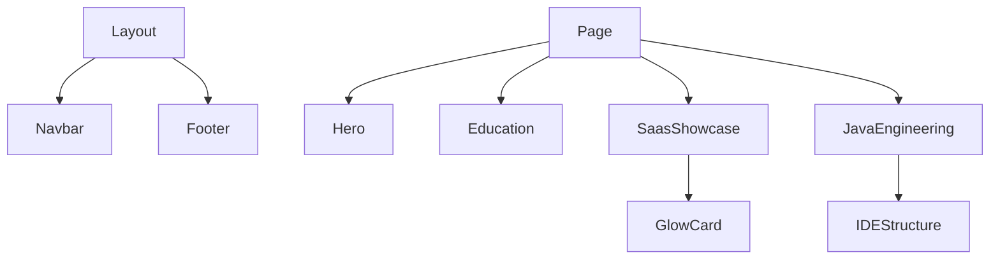

# Eduardo Santana — Portfólio


Este repositório contém a base de código do portfólio profissional de Eduardo Santana. O projeto foi projetado com foco em engenharia de software, apresentando capacidade de execução prática, arquitetura de sistemas e engenharia de software através de projetos reais.

## Funcionalidades
- **Single Page Application (SPA)**: Navegação rápida via âncoras internas com comportamento de *smooth scroll*.
- **Apresentação Hero**: Introdução objetiva com badge de disponibilidade ("Disponível para Estágio / Júnior"), avatar sincronizado com o GitHub, tagline de atuação e atalhos para LinkedIn, GitHub e Twitter/X.
- **Linha do Tempo de Formação**: Histórico acadêmico e técnico (Engenharia de Software e Técnico em Mecânica Industrial pelo IFBA) exibidos em formato cronológico vertical e responsivo.
- **SaaS Showcase (Mutum)**: Seção de destaque dedicada ao projeto SaaS Mutum contendo abas interativas (`useState`):
  - *Arquitetura*: Fluxo visual em blocos ilustrando a comunicação entre React, FastAPI e PostgreSQL.
  - *Infraestrutura*: Grid detalhado de servidores e componentes de nuvem (Vercel, AWS EC2, Docker, Nginx, SSL, JWT).
  - *Stack*: Relação das ferramentas utilizadas.
  - *Links*: Acesso direto para o MVP rodando em produção e documentação interativa Swagger.
- **Engenharia Java**: Exibição interativa que mimetiza a interface de uma IDE de desenvolvimento:
  - Painel de navegação com árvore de arquivos recursiva mapeando a organização de código do projeto.
  - Painel de padrões de projeto detalhando a implementação de camadas, ORM (Hibernate), JDBC puro, padrão DAO e tratamentos globais de exceções.
- **Animações Fluidas**: Micro-interações e efeitos de transição controlados via Framer Motion.
- **Componente de Glow**: Cards interativos equipados com rastreamento de cursor que geram efeitos de gradiente radial responsivo.

## Stack Técnica
- **Next.js** (15.1.0)
- **React** (19.0.0)
- **TypeScript**
- **Tailwind CSS** (v3)
- **Framer Motion**
- **Lucide React**

## Arquitetura

O projeto divide-se em componentes reutilizáveis, constantes centralizadas e seções modulares:



- **Navbar / Footer**: Responsáveis pela navegação estrutural e contatos externos.
- **Componentes UI**: Componentes de menor granularidade (`GlowCard`, `TechBadge`, `AnimateOnScroll`) que isolam lógica de animação e estilização visual.
- **Camada de Dados (`constants.ts`)**: Armazena de forma estática toda a árvore de diretórios dos projetos Java, histórico acadêmico e caminhos de URLs.

## Execução Local

### Pré-requisitos
- Node.js (v18+)
- npm

### Passos para inicialização
1. Clone o repositório:
   ```bash
   git clone https://github.com/Deduv/portifolio.git
   cd portifolio
   ```
2. Instale as dependências de desenvolvimento:
   ```bash
   npm install
   ```
3. Inicialize o servidor local:
   ```bash
   npm run dev
   ```
   A aplicação estará disponível em `http://localhost:3000`.

## Compilação e Validação
Para gerar a build de produção otimizada:
```bash
npm run build
```

## Autor
**Eduardo Santana**
